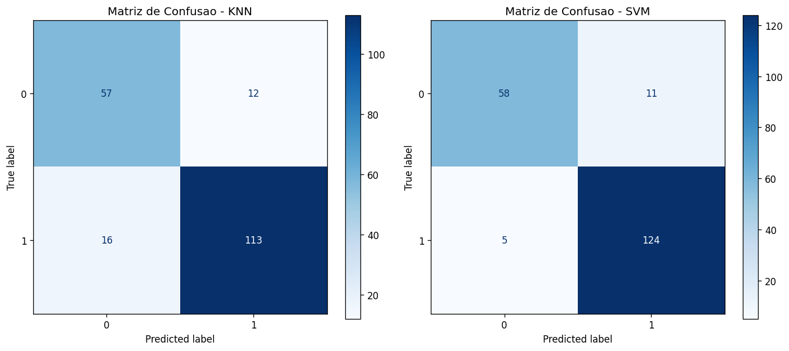
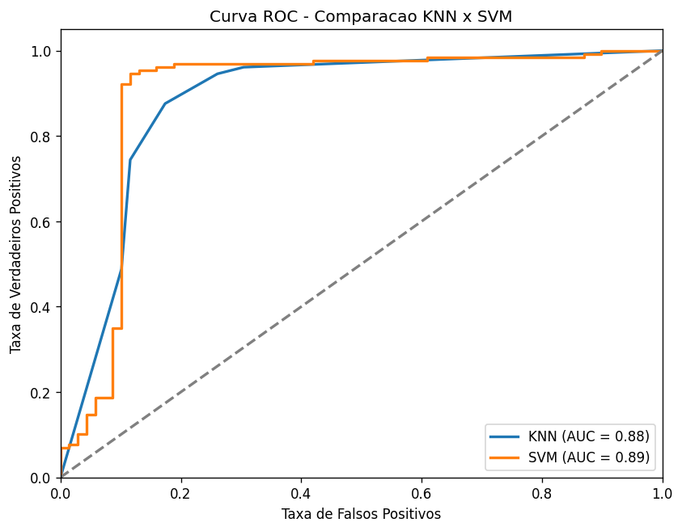
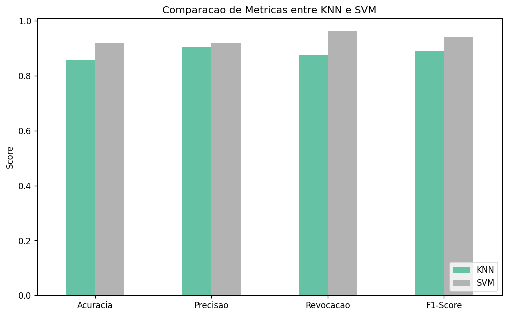

Disciplina de Inteligência Artificial , Professor Munif , Unicesumar 2026

# Classificação de Dengue com Machine Learning

Aplicação de técnicas de aprendizado de máquina supervisionado para triagem preliminar de dengue a partir de parâmetros hematológicos, com comparação entre KNN (Parte 1) e SVM (Parte 2).

---

## Integrantes

- Nome do Aluno 1 - RA: XXXXXXXX
- Nome do Aluno 2 - RA: XXXXXXXX
- Nome do Aluno 3 - RA: XXXXXXXX

---

## 1. Contextualização

A dengue é uma das arboviroses mais prevalentes no Brasil, com mais de 6 milhões de casos confirmados em 2024. O diagnóstico precoce é essencial para evitar a progressão para formas graves da doença. Alterações no hemograma, especialmente a queda de plaquetas e a leucopenia, são marcadores clínicos reconhecidos pelo Ministério da Saúde como indicadores de suspeita de dengue.

Este projeto aplica técnicas de aprendizado de máquina supervisionado para classificar pacientes como suspeitos ou não de dengue, a partir de parâmetros hematológicos rotineiros, sem necessidade de exames laboratoriais específicos e de maior custo.

---

## 2. Problema

É possível prever, com boa acurácia, se um paciente tem dengue utilizando apenas dados de um hemograma simples?

---

## 3. Hipótese

Modelos de classificação supervisionada conseguem distinguir casos de dengue de não-dengue com desempenho satisfatório a partir de atributos hematológicos como contagem de plaquetas, leucócitos e hemoglobina, atingindo acurácia superior a 85% no conjunto de teste.

---

## 4. Dataset

**Nome:** Dengue Detection Dataset (Clinical Data)

**Origem:** Dataset público disponível no Kaggle (dados clínicos e hematológicos de pacientes com e sem dengue).

**Localização no repositório:** `archive/Dengue_diseases_dataset_modified (1).csv`

**Dicionário de dados:** `archive/data_dictionary.csv`

| Atributo | Descrição |
|---|---|
| `age` | Idade do paciente em anos |
| `gender` | Gênero (Male, Female, Child) |
| `hemoglobin_g_dl` | Hemoglobina em g/dL |
| `wbc_count` | Contagem de leucócitos |
| `differential_count` | Contagem diferencial de leucócitos (binário) |
| `rbc_count` | Contagem de hemácias (binário) |
| `platelet_count` | Contagem de plaquetas |
| `platelet_distribution_width` | Largura de distribuição plaquetária (PDW) |
| `dengue_label` | **Variável alvo** — 0 = sem dengue, 1 = dengue |

**Quantidade de registros:** 989 amostras

**Balanceamento original:** 644 dengue (65%) / 345 sem dengue (35%)

### Tratamento e preparação dos dados

- **Imputação:** valores ausentes preenchidos pela mediana (numéricas) e moda (categórica).
- **One-Hot Encoding:** coluna `gender` transformada em colunas binárias (Male, Female, Child).
- **Padronização:** `StandardScaler` aplicado em todas as colunas numéricas — obrigatório para KNN e SVM, que são sensíveis à escala dos atributos.
- **Outliers:** não foram removidos. Valores extremos de plaquetas (ex.: 10.000) representam quadros severos de trombocitopenia, clinicamente relevantes para dengue hemorrágica.
- **Balanceamento:** SMOTE aplicado exclusivamente no conjunto de treino, resultando em 515 amostras por classe.
- **Divisão treino/teste:** 80% treino / 20% teste, estratificada para manter a proporção das classes.

---

## 5. Métodos de IA utilizados

### Parte 1 — KNN (k-Nearest Neighbors)

Algoritmo baseado em distância euclidiana. Classifica novas instâncias pela maioria das k instâncias mais próximas no espaço de atributos. Parâmetro utilizado: `k=5`.

Por ser sensível à escala dos atributos, a padronização com `StandardScaler` é obrigatória antes do treinamento.

### Parte 2 — SVM (Support Vector Machine)

Algoritmo que busca o hiperplano de margem máxima para separar as classes. Parâmetros utilizados: `kernel='rbf'`, `C=1.0`, `probability=True`.

- **Kernel RBF:** transforma o espaço de atributos para separar classes não linearmente separáveis.
- **C=1.0:** parâmetro de regularização que equilibra a largura da margem e a tolerância a erros de classificação.
- **probability=True:** necessário para calcular a curva ROC.

Assim como o KNN, o SVM exige padronização prévia dos dados.

---

## 6. Avaliação dos modelos

### Métricas

| Métrica | KNN | SVM |
|---|---|---|
| Acurácia | 0,86 | **0,92** |
| Precisão | 0,90 | **0,92** |
| Revocação | 0,88 | **0,96** |
| F1-Score | 0,89 | **0,94** |

### Matrizes de confusão



### Curva ROC / AUC



### Comparação gráfica entre os modelos



---

## 7. Comparação dos resultados e conclusão

O SVM superou o KNN em todas as métricas avaliadas. A diferença mais relevante está na **revocação** (0,96 vs 0,88), que representa a capacidade do modelo de identificar corretamente os casos positivos de dengue.

Para um problema de triagem clínica, a revocação é a métrica mais crítica: falsos negativos (pacientes com dengue classificados como saudáveis) representam o erro mais grave. Analisando as matrizes de confusão, o SVM cometeu apenas 5 falsos negativos contra 16 do KNN, uma diferença de 11 pacientes que teriam sido mandados para casa sem atendimento.

A hipótese do projeto foi confirmada: é possível realizar uma triagem preliminar de dengue com boa confiabilidade a partir de dados hematológicos simples. O SVM com kernel RBF foi o modelo com melhor desempenho, atingindo 92% de acurácia e 96% de revocação.

O uso de SMOTE para balanceamento das classes no treino contribuiu para que ambos os modelos detectassem melhor a classe minoritária. A padronização dos atributos foi fundamental para o bom desempenho de ambos os algoritmos.

---

## 8. Modelos treinados

Os modelos treinados estão disponíveis na raiz do repositório:

| Arquivo | Descrição | Tamanho |
|---|---|---|
| `modelo_knn.pkl` | Pipeline completo KNN treinado | ~150 KB |
| `modelo_svm.pkl` | Pipeline completo SVM treinado | ~29 KB |

Os arquivos `.pkl` incluem o pipeline completo (pré-processamento + SMOTE + classificador). Aceitam dados brutos diretamente na predição, sem necessidade de pré-processar externamente.

---

## 9. Como executar

### Notebook (treinamento e avaliação)

1. Abra o `main.ipynb` no Google Colab ou Jupyter.
2. Faça upload do arquivo CSV disponível em `archive/`.
3. Execute as células em ordem.
4. Os modelos serão salvos como `modelo_knn.pkl` e `modelo_svm.pkl`.

### API de predição (back-end)

```bash
cd api
pip install -r requirements.txt
uvicorn main:app --reload --host 0.0.0.0 --port 8000
```

Documentação interativa: `http://127.0.0.1:8000/docs`

Endpoint de predição:

```
POST /prever
Content-Type: application/json

{
  "age": 35,
  "gender": "Male",
  "hemoglobin_g_dl": 13.5,
  "wbc_count": 3000,
  "differential_count": 1,
  "rbc_count": 1,
  "platelet_count": 45000,
  "platelet_distribution_width": 17.0
}
```

### Aplicativo mobile (front-end)

```bash
cd dengue-app
npm install
npm start
```

Configure o arquivo `dengue-app/.env` com o endereço do servidor:

```
EXPO_PUBLIC_API_URL=http://SEU_IP:8000
```

---

## 10. Estrutura do repositório

```
/
├── main.ipynb                        # Notebook: treinamento e avaliação
├── modelo_knn.pkl                    # Modelo KNN treinado
├── modelo_svm.pkl                    # Modelo SVM treinado
├── matriz_confusao.png               # Matrizes de confusão KNN e SVM
├── curva_roc.png                     # Curva ROC / AUC
├── comparacao_metricas.png           # Comparação gráfica das métricas
├── archive/
│   ├── Dengue_diseases_dataset_modified (1).csv
│   └── data_dictionary.csv
├── api/
│   ├── main.py                       # API FastAPI
│   └── requirements.txt
├── dengue-app/
│   ├── App.js                        # Aplicativo React Native (Expo)
│   ├── .env                          # URL da API
│   └── package.json
└── README.md
```
